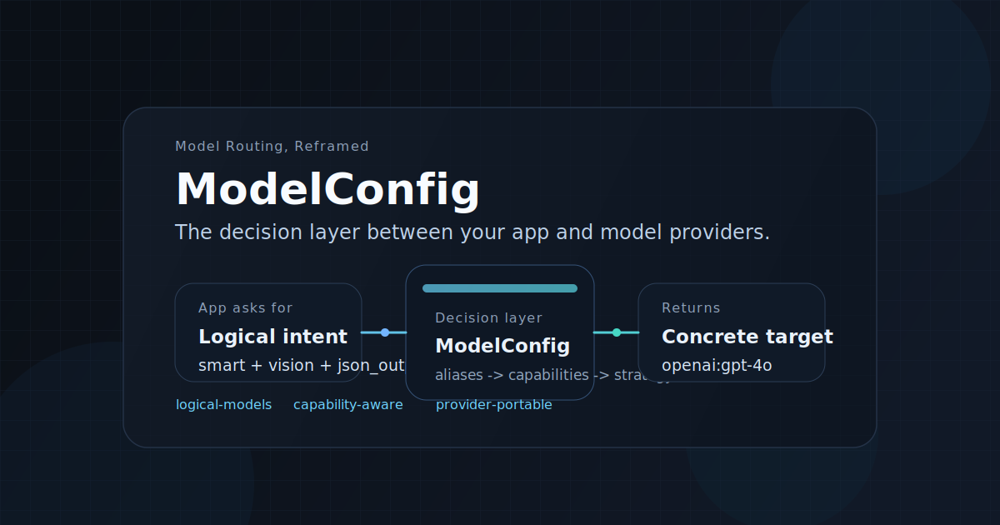

# ModelConfig

> Resolve intent, not vendor strings.

[Quick Start](#quick-start) · [Proof It Works](#proof-it-works) · [Schema](./config.schema.json) · [Contributing](./CONTRIBUTING.md)

`MIT` · `Node >=22` · `JSON Schema` · `3 runnable examples` · `Resolver-only`



ModelConfig is the missing decision layer between your app and model providers.

Ask for logical models like `smart`, `assistant`, or `cheap`. Get back a concrete provider target, model ID, base URL, and credentials reference that your execution layer can use immediately.

It keeps provider churn, fallback policy, capability gating, and environment drift out of application code, while fitting cleanly in front of OpenAI SDK, LiteLLM, or a custom client.

---

## Why This Exists

Multi-provider AI apps usually start simple, then collapse into scattered routing logic:

```ts
const model = wantsVision ? "gpt-4o" : "gpt-4o-mini";
const backup = env === "prod"
  ? "openai/gpt-4o-mini"
  : "openrouter/openai/gpt-4o-mini";
```

That approach leaks vendor strings into product code, duplicates fallback policy, and makes every provider migration more expensive than it should be.

With ModelConfig, application code stays focused on intent:

```ts
const target = resolver.resolve(config, {
  model: "smart",
  require: ["vision", "json_output"],
  env: "prod"
});
```

| Without ModelConfig | With ModelConfig |
| --- | --- |
| Vendor IDs live in app code | App code asks for intent |
| Fallbacks are duplicated | Fallback order lives in config |
| Capability checks are ad hoc | Capabilities are explicit inputs |
| Provider migration touches product code | Provider migration stays in config |
| Environments drift over time | Environments share one schema-backed model |

---

## What Makes It Different

| Capability | What it buys you |
| --- | --- |
| Resolver-only design | ModelConfig decides what to call, but never performs the request itself. |
| Logical model abstraction | Your code depends on stable names like `smart` and `assistant`, not provider-specific IDs. |
| Capability-aware routing | Require `vision`, `tools`, or `json_output` and resolve only valid candidates. |
| Provider portability | Move between OpenAI, proxies, and compatible endpoints without rewriting product logic. |
| Downstream-friendly output | Hand the result to OpenAI SDK, LiteLLM, or your own execution layer. |

---

## How It Fits Your Stack

ModelConfig sits between product logic and whatever actually executes inference.

```text
Application / Agent / API
          |
          v
      ModelConfig
          |
          v
 OpenAI SDK / LiteLLM / Custom client
          |
          v
      Provider APIs
```

That boundary is the point: routing policy stays centralized, while execution remains in the tool you already trust.

---

## Quick Start

### 1. Install

```bash
npm install modelconfig
```

### 2. Define your routing policy

```json
{
  "version": 1,
  "environments": {
    "dev": {
      "providers": {
        "openai": {
          "type": "openai",
          "api_key": "${OPENAI_API_KEY}"
        },
        "openrouter": {
          "type": "openai-compatible",
          "base_url": "https://openrouter.ai/api/v1",
          "api_key": "${OPENROUTER_API_KEY}"
        }
      },
      "models": {
        "smart": {
          "strategy": "priority",
          "candidates": [
            "smart-latest",
            "openrouter:openai/gpt-4o-mini"
          ]
        }
      }
    }
  },
  "aliases": {
    "smart-latest": "openai:gpt-4o"
  },
  "capabilities": {
    "overrides": {
      "openai:gpt-4o": ["vision", "json_output", "tools"],
      "openrouter:openai/gpt-4o-mini": ["json_output", "streaming"]
    }
  }
}
```

### 3. Resolve at runtime

```ts
import { config, resolver } from "modelconfig";

const loaded = config.loadConfig("./modelconfig.json");

const target = resolver.resolve(loaded, {
  model: "smart",
  require: ["vision", "json_output"],
  env: "dev"
});

console.log(target);
```

### 4. Receive a concrete target

```json
{
  "provider": "openai",
  "model": "gpt-4o",
  "base_url": "https://api.openai.com/v1",
  "credentials_ref": "env:OPENAI_API_KEY",
  "logical_model": "smart",
  "env": "dev",
  "metadata": {
    "logical_model": "smart",
    "env": "dev",
    "strategy": "priority",
    "required_capabilities": ["vision", "json_output"],
    "selected_candidate": "openai:gpt-4o"
  }
}
```

Pass that result directly into the execution layer you already use. ModelConfig makes the decision; downstream tools perform the call.

---

## Use Cases

### Multi-provider routing without vendor lock-in

Keep product code pinned to logical names while config decides whether `assistant` means OpenAI today, a proxy tomorrow, or a different compatible endpoint next quarter.

### Proxy and gateway migrations without rewrites

Insert an internal proxy or hosted router without editing every call site that currently embeds provider-specific model strings.

### Capability-based selection when requests are not equal

Only require `vision`, `tools`, or `json_output` when the request actually needs them, and fail with a typed error if no candidate qualifies.

### Environment-specific policy without drift

Use one policy in `dev`, a stricter or cheaper policy in `prod`, and keep both inside the same config contract.

---

## Proof It Works

| Scenario | Command | What it proves |
| --- | --- | --- |
| Base resolution flow | `npm run example:basic` | Alias expansion, capability filtering, and final `ResolveResult` generation |
| OpenAI SDK handoff | `npm run example:openai-sdk` | `ResolveResult` can be mapped into client config and request payloads |
| LiteLLM routing | `npm run example:litellm` | Primary target selection plus ordered fallback chain generation |

Relevant files:

- [`examples/basic/modelconfig.json`](./examples/basic/modelconfig.json)
- [`examples/basic/run.mjs`](./examples/basic/run.mjs)
- [`examples/with-openai-sdk/modelconfig.json`](./examples/with-openai-sdk/modelconfig.json)
- [`examples/with-openai-sdk/run.mjs`](./examples/with-openai-sdk/run.mjs)
- [`examples/with-litellm/modelconfig.json`](./examples/with-litellm/modelconfig.json)
- [`examples/with-litellm/run.mjs`](./examples/with-litellm/run.mjs)

---

## Typed Failures, Not Guesswork

Errors are explicit and stable:

- `CONFIG_INVALID`
- `ENV_NOT_FOUND`
- `MODEL_NOT_FOUND`
- `ALIAS_NOT_FOUND`
- `CAPABILITY_MISMATCH`
- `PROVIDER_NOT_CONFIGURED`

All errors share the same contract:

```ts
{
  type,
  message,
  retryable,
  details
}
```

When resolution fails, you know whether the issue came from config shape, environment lookup, alias expansion, capability mismatch, or provider registration.

---

## Design Constraints

ModelConfig is intentionally narrow. It does not try to be:

- an inference SDK
- a proxy or gateway server
- a retry engine
- a streaming transport
- an agent framework
- an observability or billing layer

That constraint is what keeps it composable. It solves one problem: choosing the right model target at runtime, cleanly and predictably.

---

## Development

Requirements:

- Node.js `>= 22`

Useful commands:

```bash
npm run build
npm test
npm run example:basic
npm run example:openai-sdk
npm run example:litellm
```

Package surface:

```ts
import { config, resolver, capability, model, provider, errors } from "modelconfig";
```

Main entry points:

- `config.loadConfig(path)`
- `resolver.resolve(config, request)`

---

## Contributing

Issues and PRs are welcome.

If you are building multi-provider AI systems and you hit an awkward routing edge case, open an issue with the exact scenario. Those real integration constraints are the fastest way to make the resolver sharper.

## License

MIT
